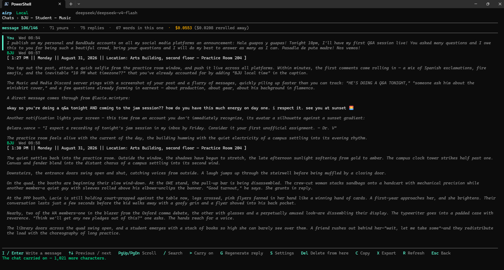
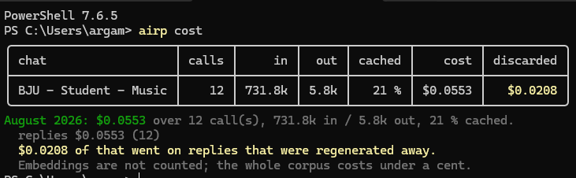
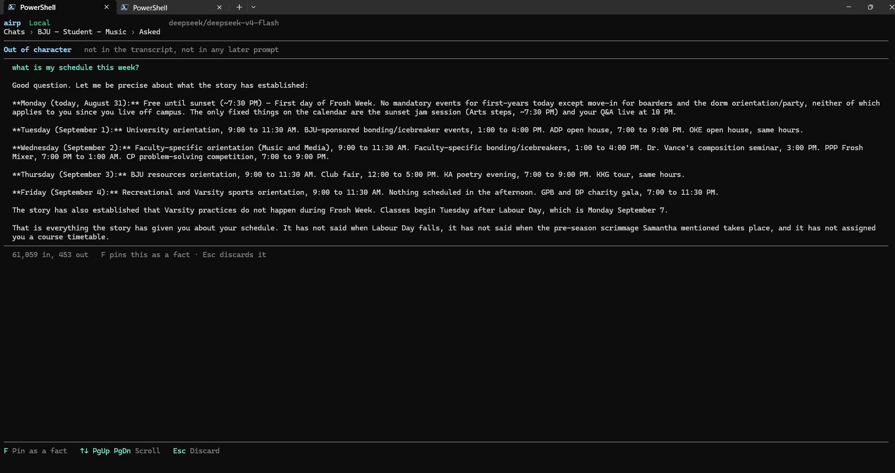

# airp

A distraction-free, keyboard-driven roleplay client that keeps its own memory, built on
.NET 10 and Spectre.Console.

Your conversations live in SQLite on your disk, and replies come from whichever language
model you point it at — no subscription, no truncated history, and nothing leaving the
machine except the prompt. A conversation that outgrows the context window is summarised
rather than dropped, old moments come back by meaning when they become relevant, and what the
story established stays true until the story says otherwise. Every reply records exactly what
it was built from, so "why did it say that" has an answer.



*Actions render italic and dimmed, speech as plain text, and both lose their markers — display
only, since the stored wording is what the next prompt sends. The header carries what this story
has cost so far, and what of that went on replies that were regenerated away.*



*`airp cost` reports a month by conversation, as a table or as JSON. **Discarded** is money spent
on replies you rerolled — the one line of spending that bought nothing. **Cached** is the share of
the prompt the provider did not have to read again, which is the layer order working or not.*



*`/ask` puts a question to the story out of character. The answer is shown and written into no
prompt, ever — `F` pins it as a fact the next turn will carry, `Esc` throws it away. Note the last
paragraph: it says what the story has **not** established rather than inventing it, which is what
the directive is written to get.*

---

## What it does

- **Memory that does not forget.** Turns that no longer fit are compressed rather than
  dropped; specific old moments are recalled by meaning; what the story established is kept
  as facts with a validity range, so a thing that stopped being true stops being sent.
- **A context budget you can inspect.** Every reply records its prompt layer by layer, with
  estimated and reported token counts side by side — `airp audit` shows it all.
- **A spend ledger and a report.** Every billed call is recorded with what the provider said
  it charged — including replies you regenerated away, which cost money and buy nothing.
  `airp cost` reports a month by conversation, as a table or as JSON, and the running total
  sits in the conversation header.
- **A library of characters and personas** as plain text files, referred to by name, so
  editing one reaches every conversation using it.
- **Reply dials** per conversation — lust, response length, creativity — with configurable
  wording, where the text you read and the text the model receives are the same text.
- **Optional per conversation**: inner thoughts, and named meters the story keeps.
- **Slash commands in the composer** — `/do` to steer a turn, `/ask` to put a question to the
  story out of character and keep the answer out of the transcript, plus free lookups for the
  card, the persona, the live facts and what it has all cost. An unknown command is refused
  rather than sent: a typo would otherwise be billed and permanent.
- **Replies drawn rather than shown raw**: `*action*` in italic and dimmed, `"speech"` as
  plain text, markers gone from the screen and kept in the store.
- The full terminal experience: carry on, regenerate with a reason, rewind, search across
  every conversation, command palette, export, clipboard.
- **`airp send`** for playing a turn from a script.
- **An OpenAI-compatible proxy**, so JanitorAI's interface on your phone can be pointed at
  your memory and your model. Janitor calls the proxy; nothing here ever touches Janitor.
- **An importer** for ourdream.ai export files, if you want old transcripts in the store.

The ourdream.ai browser client this project grew out of is its own application, in its own
repository, unchanged. This one owns `%LOCALAPPDATA%\Airp` and knows nothing about any site.

## The manuals

[`docs/MANUAL.md`](docs/MANUAL.md) — how to set it up, start a story, and everything above in
the order you would actually do it.

[`CLAUDE.md`](CLAUDE.md) — why each decision was made, and what was measured to make it.

[`CONTRIBUTING.md`](CONTRIBUTING.md) — how to run it from source, what is most wanted, and the
five invariants a change has to argue with.

---

## Getting started

The quickest way in is a [release binary](https://github.com/argamboad/custom-airp/releases)
— one self-contained file per platform, no SDK and no runtime needed:

```bash
chmod +x airp
./airp library --samples
./airp
```

To build it from source instead, you need the
[.NET 10 SDK](https://dotnet.microsoft.com/download) and a terminal that
understands ANSI colour.

```bash
dotnet build -c Release
dotnet run --project src/Airp.Terminal -c Release
```

Or install it as a global tool, after which `airp` is on your path:

```bash
dotnet pack src/Airp.Terminal -c Release
dotnet tool install --global --add-source ./src/Airp.Terminal/bin/Release Airp.Terminal
```

Set the model key once — never on the command line, where the shell history keeps it — and
check that it answers:

```bash
airp secret set OPENROUTER_API_KEY
airp ask "Say something."
airp
```

Windows encrypts the key with DPAPI. On Linux and macOS, `secret set` refuses rather than
store plaintext — export `OPENROUTER_API_KEY` in your shell instead. Native keychain and
libsecret implementations of `ISecretStore` are a welcome contribution.

An empty library is a hard place to start from, so there is a worked example — a character,
the persona facing it, an opening and a snippet — playable straight away:

```bash
airp library --samples
airp new "Cadgwith Point" --speaker Morwenna --character lighthouse --persona traveller
```

The files are in [`src/Airp.Infrastructure/Samples`](src/Airp.Infrastructure/Samples) if you
would rather read one before running anything. Nothing already in your library is ever
overwritten, so it stays safe to run later.

Everything the application keeps lives under one folder — `%LOCALAPPDATA%\Airp` on Windows,
`~/.local/share/Airp` elsewhere: the database, `airp.json`, the four library shelves,
`exports/`, `logs/` and the encrypted key. `AIRP_HOME` moves the lot, which is how a test
install stays away from a real one.

---

## Architecture

```text
src/
  Airp.Domain          Entities, value objects, typed errors. No dependencies.
  Airp.Application     Provider interfaces, options, business services, the context builder.
  Airp.Infrastructure  The local store, model clients, secrets.
  Airp.Terminal        Spectre.Console shell, views, host wiring.
  Airp.Proxy           An OpenAI-compatible endpoint over the local store. Optional.
tests/
  Airp.Tests           xUnit v3 tests for the business logic.
```

Dependencies point inwards: `Terminal → Infrastructure → Application → Domain`. Nothing in
Application or Domain references HTTP or Spectre.Console.

### The provider seam

The terminal talks to two interfaces and nothing else:

```csharp
public interface IChatProvider         : IProviderIdentity   // list the conversations
public interface IConversationProvider : IProviderIdentity   // read, send, regenerate, settings
```

`LocalConversationProvider` answers both, chosen by name at startup from `Airp:Provider`,
where `local` is the only registered value. The seam is kept deliberately: this application
began life as a second flavour behind the same interfaces, and staying one registration away
from another backend costs nothing.

Note the naming: `IChatProvider` lists conversations. The language model is a different thing
entirely, `ILanguageModelClient`.

### Which APIs it works with

**Tested against OpenRouter only.** Everything below is what the code does, not what has been
exercised in anger — if you run this against another provider, corrections and fixes are very
welcome.

The request is plain OpenAI: `model`, `stream`, `temperature`, `max_tokens`, and
`messages[{role, content}]` posted to `/chat/completions` with a bearer token. Point
`Airp:Model:BaseUrl` at DeepSeek, Together, Groq, a local Ollama or OpenAI itself, set `Name`
and `ApiKeyName`, and turns should work. The only OpenRouter-isms in the request are two
attribution headers (`HTTP-Referer`, `X-Title`) that other APIs ignore.

Three *response* fields are not standard, and the features built on them go quiet elsewhere
rather than breaking:

| Field | Elsewhere | What is lost |
|---|---|---|
| `provider` | absent | the audit's *served by* column |
| `usage.cost` | absent | `airp cost` — calls report as *unpriced* and the total says it is a floor |
| `usage.prompt_tokens_details.cached_tokens` | named differently | the cache-share column |

That last one is real rather than hypothetical: OpenAI nests it as above, while DeepSeek's own
API returns `prompt_cache_hit_tokens` and `prompt_cache_miss_tokens` at the top of `usage`.
Cost is deliberately nullable throughout for this reason — a provider that reports nothing
produces an honestly incomplete report rather than a confident $0.00.

Embeddings can point somewhere else entirely:

```jsonc
"Model": {
  "BaseUrl": "https://api.deepseek.com/v1",   // replies: cheaper, caches prefixes
  "EmbeddingBaseUrl": "https://openrouter.ai/api/v1",  // DeepSeek has no /embeddings
  "EmbeddingApiKeyName": "OPENROUTER_API_KEY"
}
```

Both embedding settings fall back to the chat ones when unset, so a single-service setup needs
no configuration at all.

**Adding a provider** should be configuration, not code. If it is not, the interesting places
are `OpenRouterClient` (one `CompleteAsync`, one response parse) and `OpenRouterEmbeddingClient`
— both are thin, and both are named after a default rather than a dependency.
### The local store

EF Core over SQLite, append-only by construction rather than by convention: `SaveChanges`
refuses to persist a deleted message or an edited one, so the invariant does not depend on
anyone remembering it. Deleting from the terminal writes a tombstone. Summaries, extracted
facts and embeddings are all derived — dropping any of those tables loses nothing that
`Messages` does not still hold.

The one exception is the spend ledger, which is not derived and cannot be rebuilt: token
counts could be re-estimated, but what a router actually charged — after its own pricing, its
choice of host and whatever cache discount applied that day — exists nowhere else once the
response is gone. It carries no story text, so `airp purge` erases the conversation and keeps
the ledger.

A retry cannot duplicate a turn: the request hash is anchored on the **last assistant reply**,
not on the next free sequence, so re-sending after a model failure collides with the message
already stored, while the same words typed again after a reply has arrived hash differently
and go through.

### The context builder

The prompt is assembled in layers ordered by volatility, the volatile last:

```text
character → persona → directives → world → summaries → history → memories → trackers → instruction
```

Everything before the first layer that changes each turn survives the provider's prefix
cache; everything after it is reprocessed. Putting retrieval in the middle — the instinctive
place — breaks the cache on every turn. Each section gets a token budget, and what was
actually sent is recorded per reply, which is what makes `airp audit` possible.

Token counts come from the real o200k tokenizer, not a chars-per-token constant; a constant
calibrated on one language was measured 31% out on another.

### The UI

Views are pure state machines: they render an `IRenderable` and answer key presses. Nothing
in a view writes to the console. The shell owns a single Spectre live display, a view stack,
and an input loop; long-running work is returned as a `ViewAction.Run` and awaited behind a
spinner while the loop keeps drawing.

---

## Development

```bash
dotnet build
dotnet test
```

653 tests cover the parts worth testing: the editor buffer, fuzzy matching, the LCS diff, the
context builder's layering and budgets, retrieval, idempotency and the append-only guard, and
each business service against substituted providers. There are no tests of getters.

Logs are written to `<app data>/logs/airp-*.log`, never to the console — console output
would corrupt the terminal display. Five files are retained. A redactor keeps keys, bearers
and message bodies out of them.

---

## Security and privacy

- **There is no telemetry.** The only endpoint is the model provider you configured, and it
  receives the prompt and nothing else.
- **API keys never touch configuration or the command line.** They are held by
  `ISecretStore` — DPAPI on Windows — and `airp secret set` reads them with the input hidden,
  because a shell history keeps whatever was typed at it. What configuration stores is the
  name of the key, not its value, so no configuration dump can print one.
- **The conversation store is not encrypted.** The SQLite database sits in your user profile
  under ordinary file permissions, and it holds the entire history in the clear. Treat that
  directory as sensitive, and never expose the proxy to the internet without a TLS tunnel and
  its bearer token.

**On JanitorAI:** this client does not automate it in any way — no sign-in, no private
endpoints, no scraping, no browser automation. Their terms prohibit bots and scripts. The
only interaction is passive: Janitor calls the proxy because you configured a Proxy URL in
your own account. Never the other way round.

---

## Licence

MIT — see [LICENSE](LICENSE).
