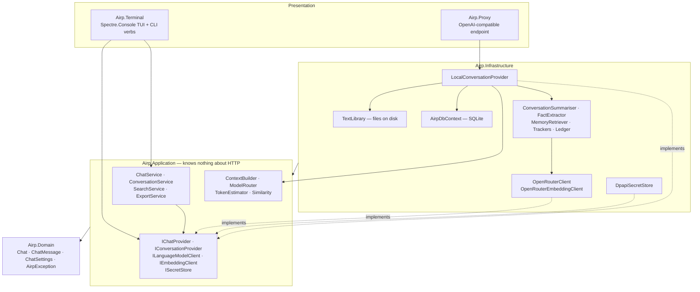
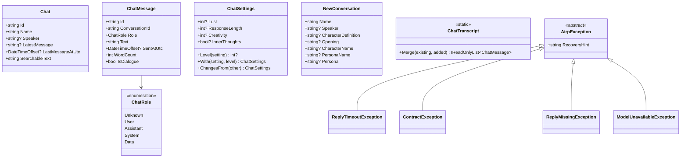
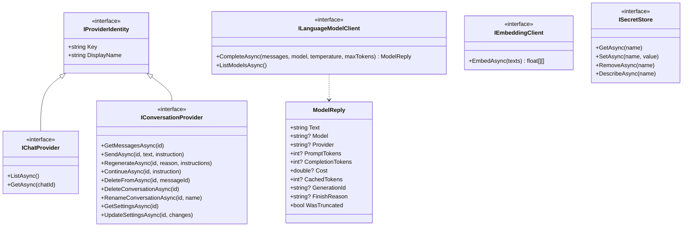
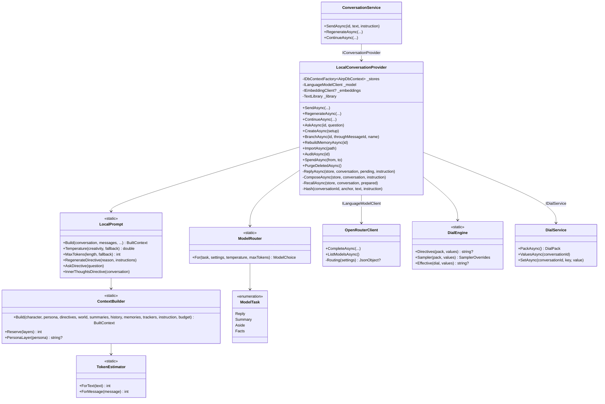
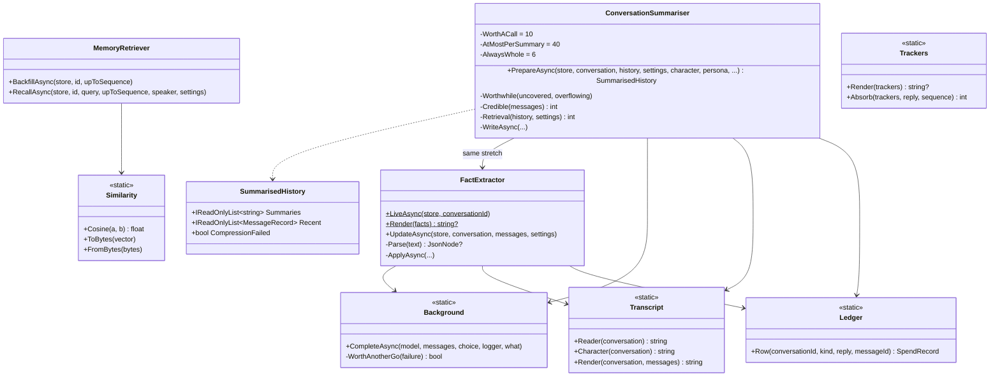
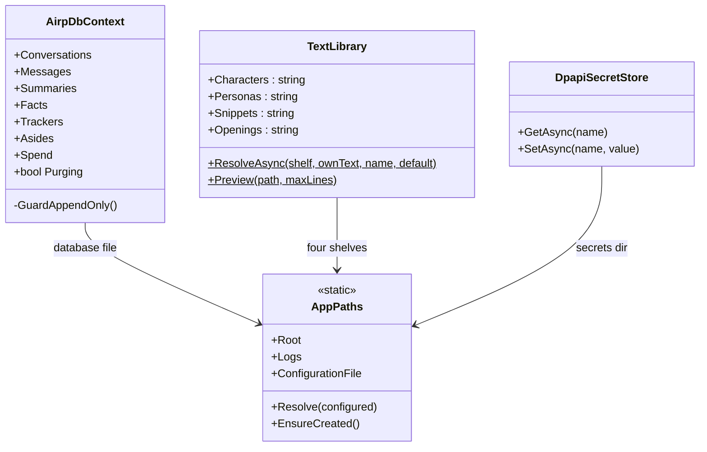
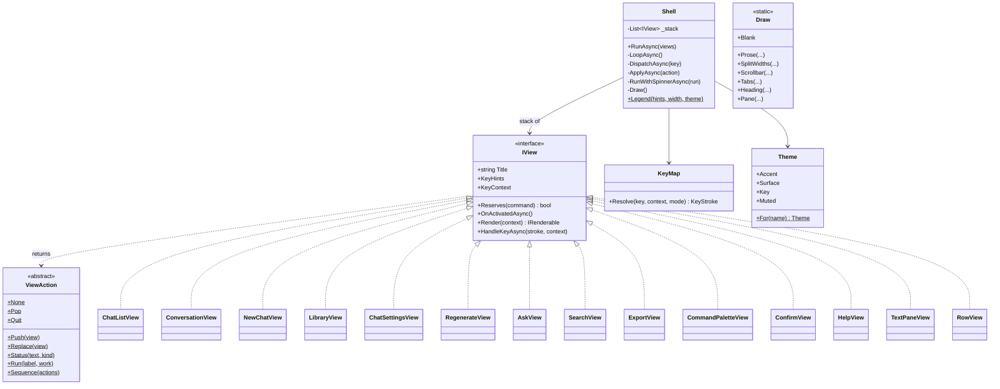
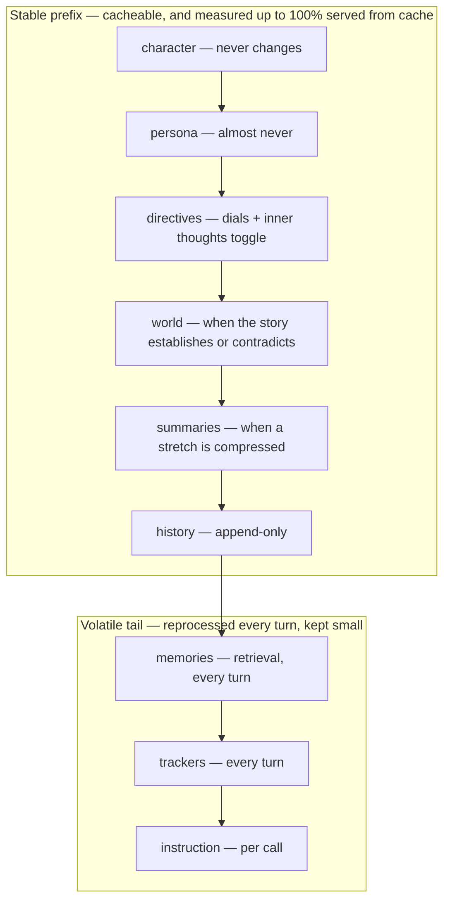

# Architecture

How the application is put together: the five projects, the seams between them, and the
classes that matter in each. The companion documents go deeper on specific questions:

| Document | Question it answers |
|---|---|
| [FLOWS.md](FLOWS.md) | what happens, step by step, when each operation runs |
| [CALLSTACK.md](CALLSTACK.md) | the same, line by line, for one send |
| [DATA.md](DATA.md) | what is stored, and under which invariants |
| [CONFIGURATION.md](CONFIGURATION.md) | every setting, its default, and where it is read |
| [GLOSSARY.md](GLOSSARY.md) | the project's own vocabulary |
| [adr/](adr/README.md) | why each decision was made, one record per decision |

---

## The map

Five projects. Dependencies point downward only; nothing below knows what sits above it.

Two rules hold this shape:

- **The terminal and the proxy only translate formats.** The terminal turns keystrokes into
  service calls and renders results; the proxy turns an OpenAI-shaped request into the same
  service calls. Neither builds a prompt, counts a token, or opens the database.
- **The provider seam survives on purpose.** The terminal talks only to `IChatProvider` and
  `IConversationProvider` ([Providers.cs](../src/Airp.Application/Abstractions/Providers.cs)).
  `LocalConversationProvider` answers both, `Airp:Provider` selects by name, and `local` is the
  only registered value — an unknown value fails at startup by name
  ([DependencyInjection.cs:60](../src/Airp.Infrastructure/DependencyInjection.cs)). A second
  backend is one registration away, and the terminal would never know.

Beware of one naming trap: **`IChatProvider` means "list the conversations"**. The thing that
calls the model is `ILanguageModelClient`.

---

## Domain and abstractions

The domain is read models and vocabulary — no behaviour beyond convenience members.

Notes that carry weight:

- `ChatSettings` uses **null to mean "never set"**, distinct from the middle level. A partial
  update (`ChangesFrom`) only carries what changed.
- `ChatTranscript.Merge` never loses a message: it de-duplicates by id and keeps the longest
  text seen per id, because a streamed reply can be captured mid-flight.
- `ReplyMissingException.Partial` carries the user's turn that *was* stored, so the caller can
  say "your message was kept — do not send it again". `ModelUnavailableException.StatusCode`
  drives per-status recovery hints.

The abstractions split along what varies
([Services.cs](../src/Airp.Application/Abstractions/Services.cs),
[LanguageModel.cs](../src/Airp.Application/Abstractions/LanguageModel.cs)):

`ModelMessage` (role + content, and nothing else) is deliberately not `ChatMessage`: one is
what crosses the wire, the other is what is stored, and keeping them apart is the seam where
the context builder decides that a stored message does not go at all.

---

## The send path

- `ModelRouter.For` gives each task its own temperature and output ceiling: replies run at the
  dials' choice, summaries at 0.3/1200, fact extraction at 0.2/4000 (a reasoning model
  deliberates before it writes JSON, and those tokens bill as output), asides at 0.4/600.
- **The dials are data** ([ADR 0016](adr/0016-dials-are-data.md)): a pack — `dials.json`, or
  the embedded default — declares scales, toggles, choices, lists and free texts, each pulling
  a `prompt` lever (text into the directives layer) or a `sampler` lever (temperature, token
  ceiling, frequency penalty). `DialEngine` renders both halves from one effective value, so
  the prompt and the sampler cannot disagree; per-conversation choices live in the
  `DialValues` table.
- `TokenEstimator` embeds the real o200k vocabulary — not a characters-per-token constant,
  because the owner plays in English (~4.7 chars/token) and writes in Spanish (~3.6).
- `OpenRouterClient` is plain OpenAI on the wire except the optional `provider` routing object,
  which is omitted entirely when unset. It treats a 200 with no message content as a failure
  and says why (`finish_reason`, host, whether only reasoning came back) —
  [OpenRouterClient.cs:131](../src/Airp.Infrastructure/Providers/OpenRouterClient.cs).

---

## The memory

Three mechanisms, three questions. All fire on their own, and only when needed.

| Mechanism | Question | How |
|---|---|---|
| Summaries | what happened? | the model compresses the stretch that no longer fits |
| Retrieval | what was said? | embeddings + cosine over already-compressed turns |
| Facts | what is true now? | extracted from the same stretch, `ValidFrom`/`ValidTo` |

The load-bearing details, each learned the expensive way (see the sequence diagrams in
[FLOWS.md](FLOWS.md) for where they sit in the flow):

- **Batching**: at least 10 messages (`WorthACall`), at most 40 (`AtMostPerSummary`), never the
  6 most recent (`AlwaysWhole`). The floor stops per-turn two-message calls whose summaries come
  out longer than what they replace; the cap stops a 99-message backlog collapsing into `##`.
- **`Credible`**: a summary shorter than `source/60` tokens is refused — the observed working
  range is 3–19×, the observed failures 84× and ~30,000×. Refusal reaches the branch that
  already exists for "could not summarise at all": send the turns whole and go over budget.
- **Reservation honesty**: the summariser reserves room for the *resolved* character and
  persona through `ContextBuilder.Reserve`, counted exactly as the builder counts them. Reading
  the conversation's own inline text instead once reserved zero for half the prompt and let 24
  turns drop unrecorded.
- **`Background.CompleteAsync`** retries exactly once, and only failures a second attempt could
  answer (no status, 200-with-no-content, 408, 429, 5xx). A rejected key fails identically
  twice and costs twice.
- **`Transcript`** is the one renderer of a stretch for a model to read; it names the reader by
  their persona, never `User`, because the extractor files facts under whatever label it sees.

---

## The store and the library

- `GuardAppendOnly` ([AirpDbContext.cs:216](../src/Airp.Infrastructure/Storage/Local/AirpDbContext.cs))
  makes `SaveChanges` **refuse** to delete a message or edit its text — the invariant enforced
  at the choke point rather than remembered. `Purging` lifts it for the one operation whose
  purpose is erasure, and only there. Full schema and invariants: [DATA.md](DATA.md).
- `TextLibrary` is four folders of text files under the data directory. One resolution rule for
  characters and personas alike: *the conversation's own text → file by name → default file*
  ([TextLibrary.cs:206](../src/Airp.Infrastructure/TextLibrary.cs)).
- Data lives in the platform's local-application-data directory (`%LOCALAPPDATA%\Airp` on
  Windows, `~/.local/share/Airp` on Linux, `~/Library/Application Support/Airp` on macOS);
  `AIRP_HOME` overrides it. Secrets are DPAPI-protected on Windows and fall back to an
  environment variable of the same name elsewhere; they never pass through `IConfiguration` —
  `EnvironmentOverrides` discards variables ending in `_KEY` and `_TOKEN`.

---

## The terminal

A stack of views under one shell. The shell owns the loop; a view owns one screen.

The dispatch contract, which every view test must honour:

1. `Shell` reads a raw key (bracketed-paste aware, mouse optional).
2. `KeyMap.Resolve` turns it into a `KeyStroke` carrying an `AppCommand`, respecting the view's
   `KeyContext` (navigation vs. text entry) and the configured dialect (Standard/Vim). **View
   tests must resolve strokes through the real `KeyMap`** — a hand-built stroke once shipped a
   dead key.
3. The view's `HandleKeyAsync` returns a `ViewAction`; the shell applies it — push, pop,
   replace, status, or `Run`, which shows a spinner while awaited work runs and then applies
   whatever that work returned.

Everything drawn goes through `Theme` (palette is data; monochrome reduces to decorations) and
`Draw` (one shape per control: tabs, headings, panes, the scrollbar, prose styling). Both
two-pane views split at three tenths through `Draw.SplitWidths`, which reserves three columns
for the rule — the bar and a space either side.

The same executable is also the CLI: `Program.Main` dispatches ~20 verbs (`run`, `new`, `send`,
`ask`, `audit`, `cost`, `rebuild`, `fact`, `tracker`, `library`, `secret`, `config`, …) on the
first positional argument, `run` being the TUI
([Program.cs:69](../src/Airp.Terminal/Program.cs)).

---

## The proxy

One file of pipeline, two of shape. `Airp.Proxy` is an ASP.NET minimal API exposing
`/v1/models` and `/v1/chat/completions`, so a third-party front end (Janitor, configured with a
Proxy URL) can play against the local store. It is only ever *called* — it never contacts the
front end's site.

- **Bearer token always**, compared in constant time; the process refuses to start without one
  ([Program.cs](../src/Airp.Proxy/Program.cs)). It is a different secret from the model key: this
  one gets typed into a third party's settings.
- `SessionResolver` maps the incoming request to a stored conversation by three strategies in
  trust order — explicit `[[rp:<id>]]` tag, unique speaker name, opening-text prefix — and
  **refuses rather than guesses** when none is unambiguous, because a turn written into the
  wrong conversation is permanent.
- Only the newest user turn is taken from the request; the front end's truncated history is
  discarded and the prompt is rebuilt from the store by the same `ComposeAsync` the terminal
  uses.
- `stream: true` is honoured by chunking the finished reply as SSE — the reply is complete
  before the first byte goes out, split by text element so no surrogate pair is cut.

What has never run: this proxy against real Janitor.

---

## The prompt, as a cache diagram

The one picture that explains the cost table. Layers run from least to most volatile; a
provider's prefix cache holds everything up to the first thing that changed since the previous
turn.

Putting retrieval in the middle — the instinctive place — would break the cache on every turn:
measured as seconds vs. minutes on a local model, and $0.0028/M vs. $0.14/M on a caching API.
When the budget binds, **the transcript gives, oldest first**; everything else is small or was
chosen for this turn. Whether the serving host caches at all is a per-request lottery (61% vs.
0% for the same conversation on the same day), which is what `Model:PreferProviders` /
`Model:IgnoreProviders` exist to pin.
