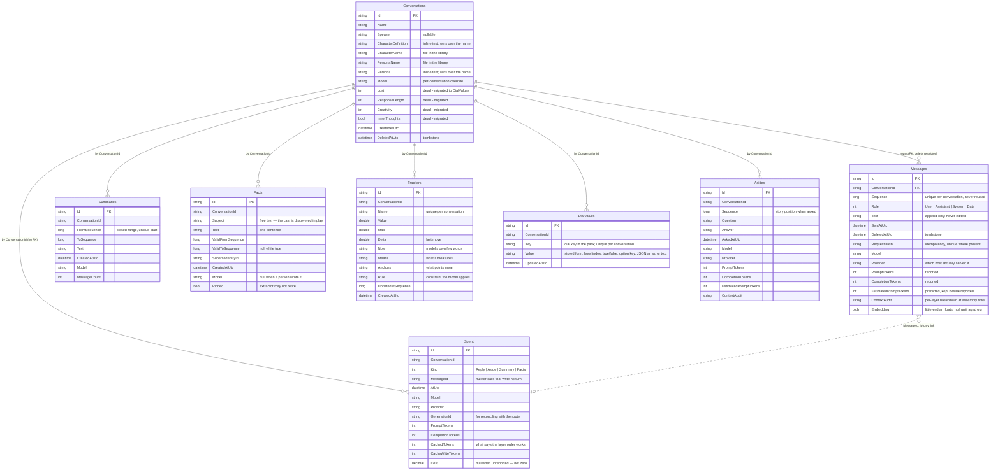

# Data

The SQLite store: every table, every column, and the invariants that own them. Schema source:
[Entities.cs](../src/Airp.Infrastructure/Storage/Local/Entities.cs) and
[AirpDbContext.cs](../src/Airp.Infrastructure/Storage/Local/AirpDbContext.cs). The database
file lives at `Airp:DatabaseFile` (default `./airp.db`), resolved against the data directory:
`%LOCALAPPDATA%\Airp` on Windows, `~/.local/share/Airp` on Linux (`XDG_DATA_HOME` respected),
`~/Library/Application Support/Airp` on macOS — `AIRP_HOME` overrides all three. **It holds
the entire history in the clear** — never expose a direct port; tunnel with TLS.

---

## The diagram

---

## The invariants, and where each is enforced

1. **`Messages` is append-only.** `AirpDbContext.SaveChanges`/`SaveChangesAsync` route through
   `GuardAppendOnly` ([AirpDbContext.cs:216](../src/Airp.Infrastructure/Storage/Local/AirpDbContext.cs)),
   which throws on a pending message delete **or a text edit** — the edit matters more, because
   it loses what was said while looking innocent. Conversations cannot be deleted either (they
   would take their messages). The single exception is `Purging = true`, set only inside
   `PurgeDeletedAsync`, the operation whose whole purpose is erasure — and it must be set in a
   line of code that says so.
2. **The user's turn is persisted before the model is called.**
   `LocalConversationProvider.SendAsync` inserts and saves at line 291–303, then calls
   `ReplyAsync`. A model failure leaves the turn stored and hands it back inside
   `ReplyMissingException`.
3. **Idempotency by `RequestHash`, anchored on the last reply.** The hash covers
   `{conversationId | anchor | text ␟ instruction}`; the unique filtered index
   `(ConversationId, RequestHash)` makes the database the arbiter. Anchoring on the next free
   position would give a retry a different hash and store the line twice.
4. **Auditing is mandatory.** Every reply stores `ContextAudit` (the per-layer breakdown as
   assembled), `EstimatedPromptTokens`, and the reported counts beside it. `airp audit` reads
   them. The estimate is kept next to reality so the budget cannot quietly stop meaning
   anything.
5. **`Facts` uses `ValidFrom`/`ValidTo`.** A fact stops being true by gaining a
   `ValidToSequence`, never by deletion or edit. Only the live set (`ValidToSequence == null`)
   is rendered into the prompt; the rest stays readable history. Pinned facts (written by hand
   via `airp fact add` or `F` in the ask pane) cannot be retired by the extractor — only by the
   reader.
6. **Summaries, facts and embeddings are derived.** All three can be reproduced from
   `Messages`; `airp rebuild` does exactly that, through the ordinary compose path. Pinned
   facts are the exception — derived from nothing, therefore kept.
7. **`Spend` is a ledger, and the one table that is *not* derived.** One row per billed call —
   replies, asides, compression, extraction — written *before* the output is judged, and kept
   whatever became of it. What a router actually charged (its pricing, its host choice, that
   day's cache discount) exists nowhere else once the response is gone. Whether a reply was
   discarded is read from its tombstone **at report time**, never stored — so a turn rerolled
   tomorrow counts as discarded tomorrow. Purging a conversation counts the ledger and leaves
   it (`LedgerKept`); there is deliberately no FK from `Spend` to `Messages`.
8. **`Asides` never enters a prompt.** A question asked out of character is not a turn. Stored
   as one, retrieval would embed it, the summariser would compress it as something that
   happened, the extractor would pull facts from it — and append-only would make all of that
   permanent. The table exists because the call was billed (invariant 4), not because anything
   reads it back.

---

## Deletion, in its three strengths

| Gesture | What actually happens |
|---|---|
| Delete a message / reroll | `DeletedAtUtc` set — hidden from every prompt and view, kept for the audit |
| Delete a conversation | `DeletedAtUtc` on the conversation row — messages untouched |
| `airp purge` | the one true erasure: rows removed under `Purging = true`, ledger kept, then `VACUUM` so the pages are actually released |

## Notes that keep biting

- **SQLite stores `DateTimeOffset` as text** and cannot order or compare on it in SQL. Every
  ordering or windowing on a timestamp happens in memory after the read
  (`SpendAsync`, `AsidesAsync`, `PurgeableAsync`). It crashed once; it is not allowed to again.
- **`Sequence` is the ordering key**, not the timestamp — two turns of one exchange can share a
  clock tick, and imports carry whatever timestamps the export had. `NextSequenceAsync` counts
  hidden rows too: reusing a tombstoned row's number would collide with the unique index.
- **`Cost` is `decimal`**, converted once at the ledger boundary from the wire's `double` —
  hundreds of ~$0.0028 rows summed as binary floating point produce `0.0006000000000000001`,
  and a money report that apologises for its arithmetic is one nobody checks.
- **`Embedding` is a BLOB scanned in memory** — a few thousand vectors is microseconds, and an
  index would be machinery guarding nothing.
- **Embeddings are not in the ledger**: OpenRouter's `/embeddings` costs ~$0.02/M and the spend
  report says it excludes them rather than implying completeness.

## What lives outside the database

The dial pack — `dials.json` beside `airp.json`, or the embedded default when the file does
not exist. The `DialValues` table stores only choices; what a key *means* lives in the pack,
so a row whose key the pack no longer declares simply says nothing.

The library — four shelves of plain text files under the data directory: `characters/`,
`personas/`, `snippets/`, `openings/`. A conversation stores a **name**, not a copy; editing
the file reaches every conversation using it. An opening's filename matching a character's name
*is* the association. Secrets live under `secrets/` (DPAPI-encrypted on Windows; on Linux and
macOS an environment variable of the same name serves instead); logs under `logs/`;
configuration in `airp.json` ([CONFIGURATION.md](CONFIGURATION.md)).
