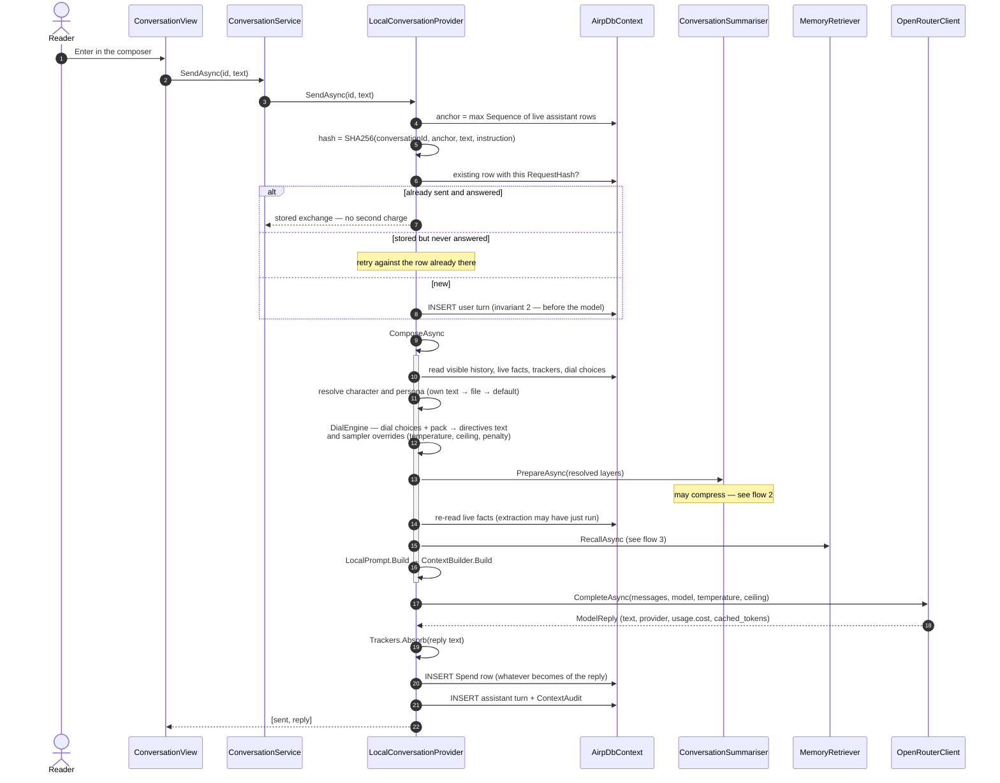
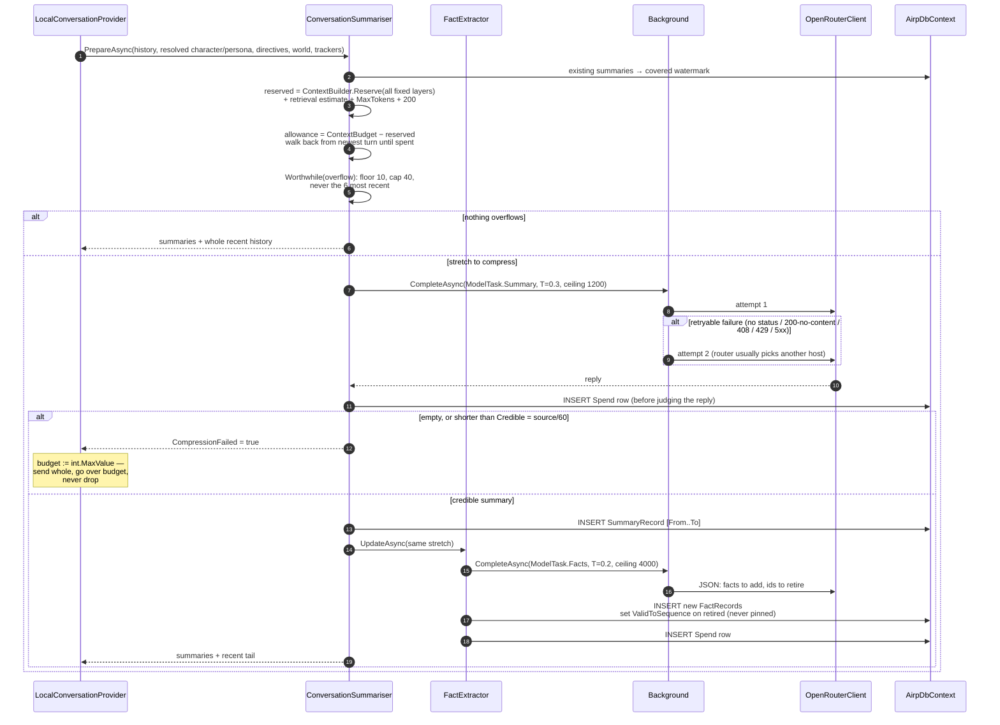
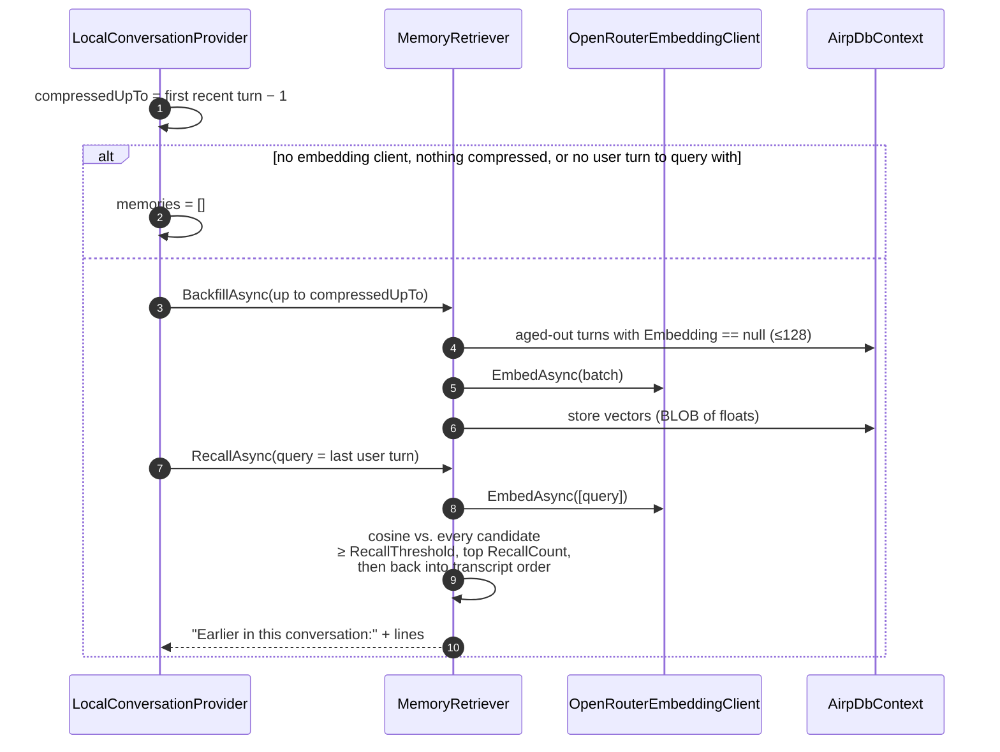
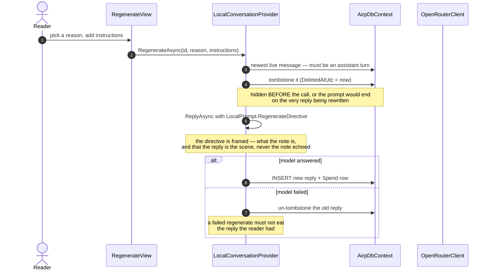
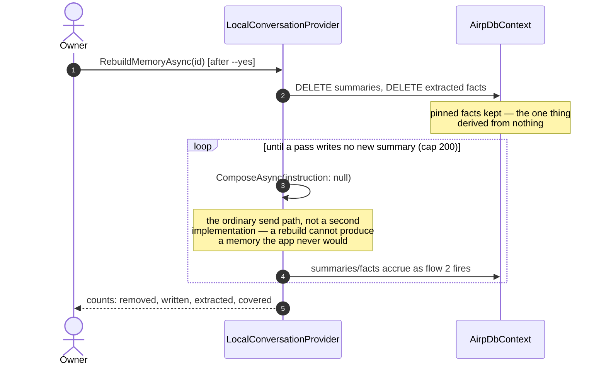
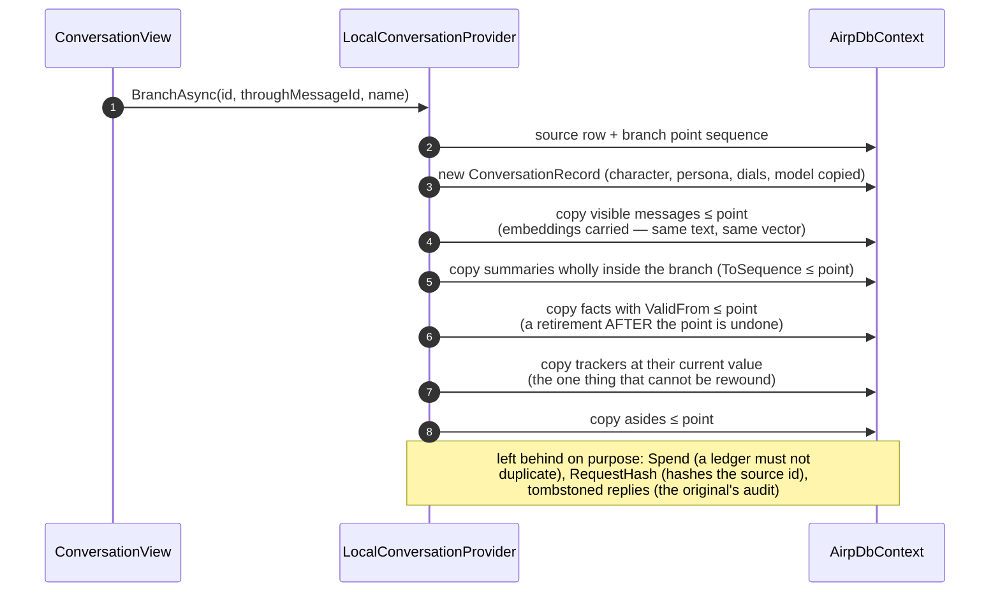
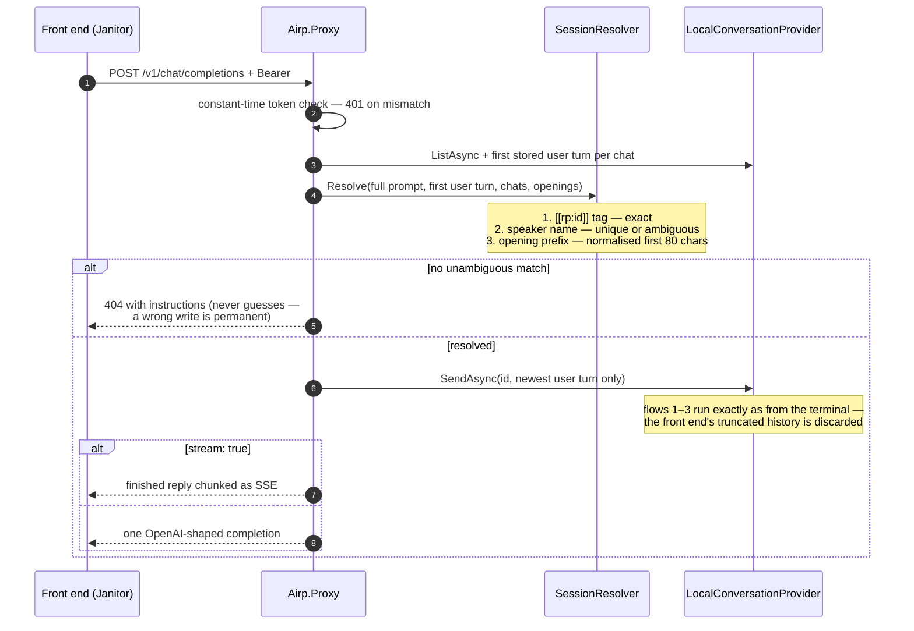
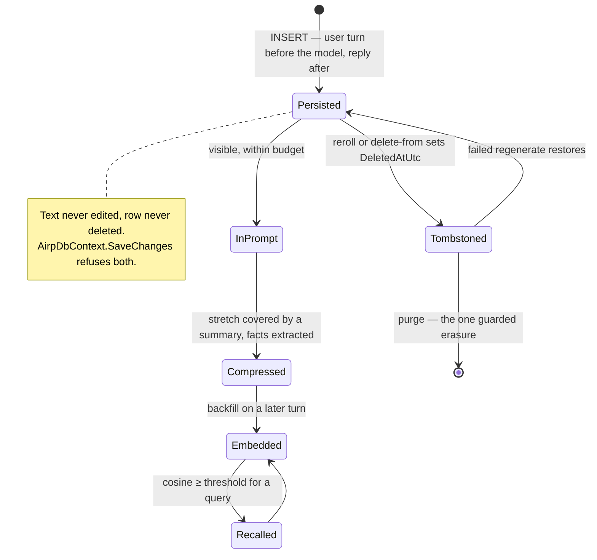
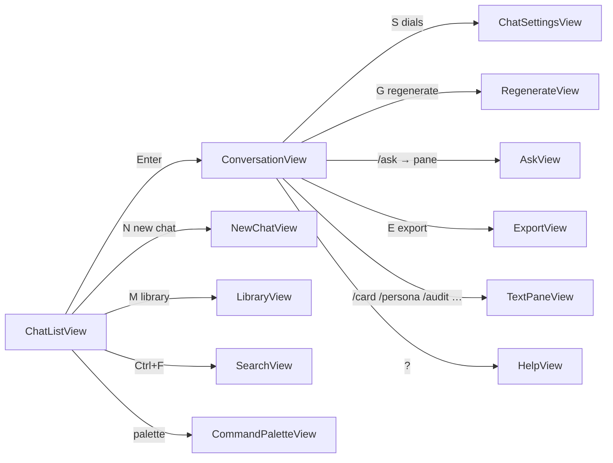

# Flows

The call stacks that matter, one sequence diagram per story. Line-level detail for the first
of them lives in [CALLSTACK.md](CALLSTACK.md); the classes are mapped in
[ARCHITECTURE.md](ARCHITECTURE.md).

---

## 1. A send, end to end

The path every turn takes: keypress → persist the user's turn → compose (which may compress)
→ model → persist reply + audit + spend row.

If the model fails, the user's turn is **not** undone: the caller gets a
`ReplyMissingException` carrying it, with the hint *do not send it again* — the retry finds the
unanswered row by its `RequestHash` and asks again instead of storing the sentence twice.

---

## 2. Compression firing

Runs inside `ComposeAsync`, before the prompt is built — never after, because the builder's
only tool for an over-budget prompt is dropping turns.

The summariser and extractor read the stretch through one renderer, `Transcript.Render`, which
names the reader by their persona — the extractor files facts under whatever label it sees,
and `User` once split one person into two subjects.

---

## 3. Retrieval, every turn

Failures degrade to an empty list and a log line — retrieval improves a prompt; it is never
the reason a reader cannot get a reply. Only already-compressed turns are candidates: recent
ones are sent whole anyway.

---

## 4. Regenerate

The old wording stays in the database under its tombstone — `airp audit` still shows it,
because "why did it say that" is almost always asked about a reply that was thrown away. The
spend report reads discardedness **from the tombstone at report time**, never stores it.

---

## 5. `airp rebuild` — invariant 6, spent deliberately

The ledger is added to, never reset — the first attempt's calls happened. Without `--yes` the
command prints what it would replace and touches nothing.

---

## 6. Branch at the cursor (`B`)

---

## 7. The proxy — playing from a third-party front end

---

## 8. Message lifecycle

---

## 9. TUI navigation

The shell holds a stack; every arrow pushes, `Esc` pops.

Twelve slash commands live in the composer (`/do`, `/ask`, `/focus` billed; `/card`,
`/persona`, `/facts`, `/trackers`, `/audit`, `/cost`, `/search`, `/help` free; `/fact`,
`/tracker` write). An unrecognised command is refused, never sent; `//` escapes a literal
slash. `F` in the ask pane promotes an answer to a pinned fact.
